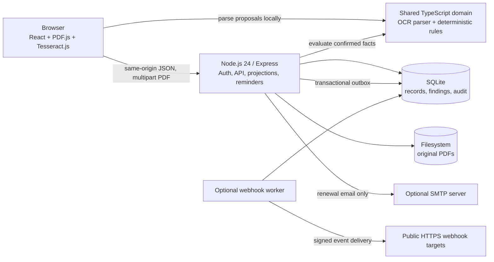

# Architecture

OpenCOI v0.2 keeps a deliberately understandable single-node data plane: a React browser client, Node.js/Express, SQLite, and local document storage. It adds a versioned service API and independently runnable webhook worker, while continuing to favor inspectable document decisions and operational simplicity over live insurance-system connectivity or unsupported horizontal-scale claims.

The system's output is always scoped to an uploaded document. No component contacts an insurer, broker, carrier, or agency-management system to establish current policy status.

## Component map

In development, Vite serves the browser app on port 5173 and proxies `/api` to Express on port 4174. In production, Express serves the compiled browser assets and API from one origin.

## Browser client

The `client/` application provides the dashboard, vendor directory, requirements editor, intake and review workspace, exception decisions, reminders, audit view, and CSV download entry points.

Document intake is intentionally client-first:

1. PDF.js opens the selected file and reads digital text layers.
2. Pages without enough usable text are rendered to canvas and processed by Tesseract.js in a browser worker.
3. The shared heuristic parser proposes parties, policy rows, dates, limits, and common endorsement indications.
4. A person compares those proposals with the PDF and corrects them.
5. Only submission sends the original PDF, extracted text, and reviewed structured facts to the OpenCOI server.

Vendor-link submissions are forced to `UNCONFIRMED` by the server, regardless of client input. An authenticated reviewer must explicitly attest to the extraction before the server re-evaluates it as confirmed evidence. See [OCR_AND_REVIEW.md](OCR_AND_REVIEW.md).

## Shared domain and evaluator

`shared/` contains code used on both sides of the application:

- typed document, policy, evidence, finding, exception, and status primitives;
- strict Zod schemas for versioned rules;
- deterministic date, limit, coverage, policy-field, and endorsement evaluation;
- OCR text normalization and conservative field proposal heuristics; and
- vendor-neutral benchmark contracts and deterministic fact/citation scoring; and
- CSV serialization with spreadsheet-formula neutralization.

The evaluator takes all time-sensitive context explicitly, including an ISO evaluation date. It does not read the system clock internally. Given the same canonical document facts, rule version, evaluation date, and engine version, it returns the same base findings.

`UNKNOWN` is a first-class result, not a temporary false value. Unconfirmed evidence cannot satisfy a rule. Exceptions are supplied and displayed separately and never mutate a finding or the base document label. Detailed semantics are in [RULES.md](RULES.md).

## Server process

The `server/` process owns the following boundaries:

- configuration parsing and fail-fast validation;
- local-password and optional OpenID Connect authentication with one shared session lifecycle;
- organization scoping and role authorization;
- trusted-origin and CSRF enforcement;
- a global per-client request ceiling plus stricter login and public-link limits;
- vendor, requirement, document, exception, reminder, export, and audit routes;
- PDF byte-level triage and filesystem storage;
- canonical server-side evaluation and persisted findings;
- UI projections such as dashboard and lifecycle status; and
- tenant-bound scoped service accounts, the `/api/v1` contract, domain events, and integration administration; and
- scheduled or CLI-triggered reminder cycles.

The browser JSON API is under `/api`; `/api/health` is unauthenticated for container health checks. Most application endpoints require a session. Mutating authenticated routes additionally require a trusted origin, a matching CSRF header and readable CSRF cookie, and an allowed role. Public upload routes use a high-entropy, expiring, revocable link token and a narrower API surface.

Third-party clients use the separately authenticated and versioned `/api/v1` surface. It has cursor pagination, scoped bearer access, Problem Details, request IDs, idempotent writes, and ETag preconditions. Browser endpoints remain an internal application interface. See [API.md](API.md).

## Persistence model

SQLite stores organizations, users, sessions, short-lived OIDC login transactions and identity bindings, vendor types, published requirement snapshots, vendors, upload links, document metadata, certificate facts, policy rows, endorsement evidence, findings, exceptions, reminders, audit events, service accounts, webhook endpoints, append-only domain events, delivery state, and API idempotency records.

Important storage properties include:

- Node.js 24's built-in SQLite driver, strict tables, foreign keys, WAL mode, and a busy timeout;
- organization-qualified foreign keys and repository queries;
- integer minor units for money and ISO `YYYY-MM-DD` calendar dates;
- persisted requirement version and evaluation date alongside document extraction context;
- original-file SHA-256 hashes; and
- audit events linked by per-organization sequence number, previous hash, and event hash, with database triggers rejecting update and delete.

Original PDFs are stored outside SQLite beneath `UPLOAD_DIR`. Storage keys are generated UUID paths, validated before use, and never derived from user filenames. Files are created with owner-only permissions. The database record and PDF directory are one durable unit and must be backed up and restored together.

The standard container mounts both at `/app/data`. See [BACKUP_RESTORE.md](BACKUP_RESTORE.md).

## Requirement publication and decision history

Publishing a requirement profile creates a numbered JSON snapshot and updates the active projection used for new evaluations. A certificate stores the version and evaluation date used, while its findings preserve the resulting expected and observed values and reason codes.

v0.2 exposes the current profile editor and historical result context, but not an arbitrary replay or migration console. A requirement edit does not silently recompute prior stored findings.

## Reminder execution

The reminder service selects active vendors whose latest confirmed certificate shows an expiration within the worker horizon. It creates a deterministic deduplication key for that certificate and printed expiration date.

- With SMTP and a vendor contact email, the worker sends a bounded renewal message.
- Without SMTP, it records in-app reminder work without attempting external delivery.
- The server can poll on the configured interval, and operators can run the same cycle with `npm run reminders:run`.

Reminder language says that the date came from a submitted document. A missing reminder is not evidence that a policy remains active.

## Authentication and authorization

The bootstrap administrator is created only when there are no users. Local password sign-in remains available as a break-glass path. Operators can optionally configure one OpenID Connect provider for one explicit organization slug.

- Passwords are salted and hashed with scrypt.
- OIDC uses Authorization Code with PKCE S256, random state and nonce, exact issuer validation, a ten-minute one-use server-side transaction, and a callback-only `HttpOnly`, `SameSite=Lax` cookie.
- The first OIDC sign-in binds `(issuer, subject)` only to an already active OpenCOI user with the same verified email. Later sign-ins use that immutable binding; OIDC never creates a user or assigns a role.
- OpenCOI discards provider tokens after establishing its own session. OIDC and local authentication issue the same strict application session and CSRF cookies.
- Session and CSRF bearer values have 256 bits of entropy; only digests are stored.
- Session cookies are `HttpOnly`, `SameSite=Strict`, and `Secure` when configured for HTTPS.
- A separate readable CSRF cookie must match the `X-CSRF-Token` header and stored digest.
- Roles are `owner`, `admin`, `reviewer`, and `viewer`; routes enforce the roles permitted for each mutation.
- Data repositories and direct queries are scoped by organization.

OpenCOI does not enforce an identity provider's MFA policy and does not include SCIM, passkeys, provider group-to-role mapping, multiple OIDC providers, or an account-administration UI. Test the local break-glass account and provider recovery procedures before depending on SSO.

## PDF trust boundary

Every uploaded file is untrusted. Before storage, the server:

- enforces the configured byte-size limit;
- requires a PDF signature at byte zero instead of trusting the filename or MIME claim;
- rejects encrypted files;
- rejects common JavaScript, launch action, embedded-file, rich-media, and XFA markers;
- rejects an estimated page count above 75; and
- stores the file under a generated, path-constrained key.

These are conservative intake checks, not a complete parser sandbox, malware scanner, or content disarm/reconstruction system. Internet-facing operators should isolate the service and add scanning controls based on [THREAT_MODEL.md](THREAT_MODEL.md).

## Integration delivery

An API mutation and its domain event are committed in the same immediate SQLite
transaction. Matching webhook delivery rows are part of that outbox write.
Workers atomically lease due rows, sign the exact serialized event body, resolve
and validate a public HTTPS target, pin the checked IP for the request, and
record success, retry, or dead-letter state. Delivery is at least once and the
stable event ID is the receiver's deduplication key. The worker can run as a
separate process or optional Compose-profile service.

## Deployment topology and scale

The supported bundled v0.2 topology is one application process or container, optional external job workers, and one persistent data directory. Do not run multiple web replicas against the same SQLite database or document directory.

This boundary keeps deployment and backup comprehensible, but it also means:

- no built-in high availability or distributed job coordination;
- document and database capacity are limited by the host;
- in-process rate-limit state is not shared across replicas; and
- operators must monitor disk, memory, backups, and reminder execution.

The vendor directory no longer performs per-vendor queries: its summary
projection is one aggregate SQL statement, with a query-count regression and a
hardware-labelled 100/1,000/10,000-vendor benchmark. The stable integration API
uses cursor pages capped at 100. Those changes remove a measured hot path; they
do not demonstrate concurrent write capacity, failover, or horizontal scaling.
Multi-replica support still requires a transactional server database,
distributed rate limits and leases, shared object storage, and failover tests.

The Compose service runs without Linux capabilities, as a non-root user, with a read-only root filesystem and an ephemeral size-limited `/tmp`. TLS termination, encrypted durable storage, secrets management, edge abuse protection, malware controls, monitoring, and retention remain operator responsibilities. See [DEPLOYMENT.md](DEPLOYMENT.md).

## Failure and integrity behavior

- Invalid configuration fails startup rather than silently weakening a control.
- A failed PDF/database transaction removes the newly stored file.
- Missing or unconfirmed rule evidence returns `UNKNOWN` or `FAIL` according to review state; it never defaults to zero or pass.
- Public upload tokens are stored as digests and can expire, exhaust their use count, or be revoked.
- Reminder keys prevent duplicate creation for the same certificate and printed expiration date.
- Server-generated compliance CSV neutralizes attacker-controlled cells before spreadsheet interpretation.
- Audit verification recomputes the event hash chain and exposes inconsistency; it does not make a compromised host trustworthy.

## Explicit non-goals for v0.2

- live insurer, carrier, broker, or agency-management-system monitoring;
- policy cancellation or reinstatement feeds;
- legal, insurance, underwriting, or claims advice;
- automatic approval of OCR or ambiguous endorsement language;
- cloud OCR or generative-AI document interpretation;
- managed certificate review, SCIM, MFA enforcement, or enterprise compliance certification;
- built-in antivirus/CDR or a guarantee that a hostile PDF is harmless; and
- horizontal scaling against a shared SQLite volume.

Future work is tracked in the [roadmap](../ROADMAP.md).
